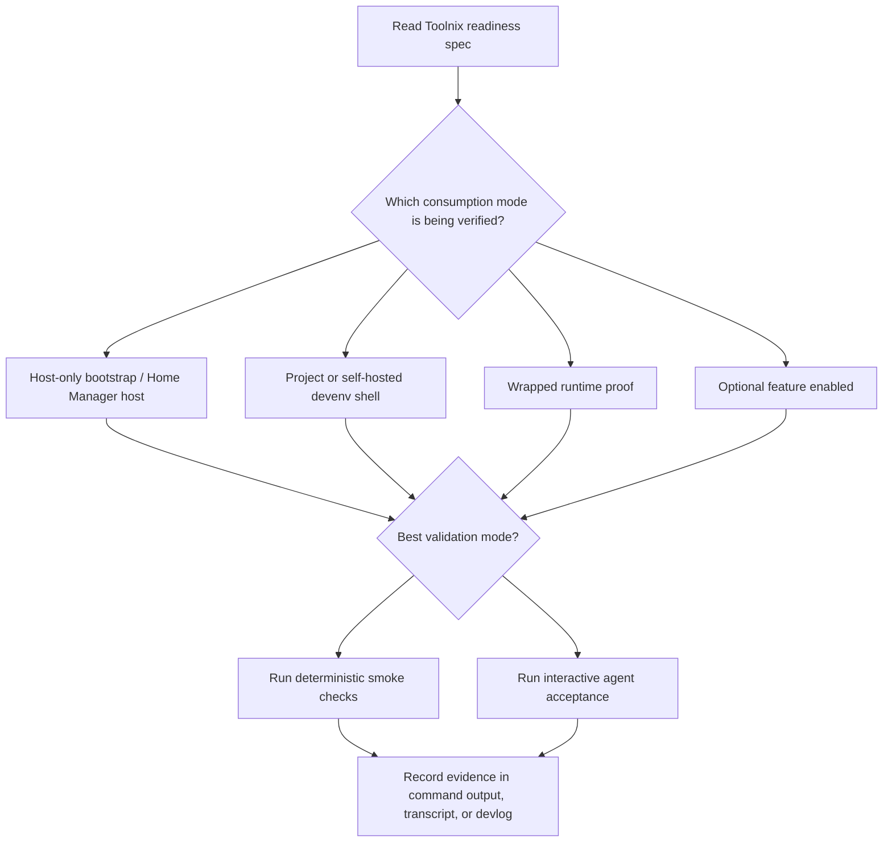

# Toolnix Agent Readiness Requirements

## Summary

Create a Toolnix-native readiness spec that adapts the useful pattern from `lefant/hackbox-ctrl`: plain-language readiness scenarios, explicit validation modes, and diagrams that make host/project/optional-feature readiness easy to understand. The spec should be usable both by agents verifying a VM or project shell and by humans trying to understand what Toolnix considers ready.

---

## Problem Frame

Toolnix now exists to support agent-native coding in disposable environments. The strategy centers on dedicated Toolnix-managed VMs and Nix-managed setup so agents can modify and verify freely without crossing trust boundaries.

The repository has bootstrap scripts, proof docs, smoke checks, architecture diagrams, and devlogs, but it does not yet have one canonical readiness document that tells an agent or reader what “ready” means across the main Toolnix consumption modes. The Hackbox readiness spec provides a strong precedent: it separates deterministic smoke checks from interactive acceptance checks and writes expectations in executable plain language.

---

## Actors

- A1. Maintainer: evolves Toolnix and needs a clear readiness contract before changing host, project, or agent baselines.
- A2. Verification agent: runs plain-language checks on a Toolnix-managed VM or project shell and reports evidence.
- A3. Human reader: wants to understand the readiness model without already knowing Hackbox inventory/control-host concepts.
- A4. Project consumer: imports Toolnix into a project shell and expects the declared baseline to work without bespoke setup.

---

## Key Flows

- F1. Agent verifies a Toolnix VM or project shell
  - **Trigger:** A maintainer asks an agent to prove a Toolnix environment is ready after bootstrap, rollout, or config change.
  - **Actors:** A1, A2
  - **Steps:** The agent identifies the applicable consumption mode, follows the spec’s plain-language readiness scenarios, runs deterministic smoke checks where available, runs interactive shell/tmux/agent checks where appropriate, and reports evidence.
  - **Outcome:** The maintainer can see which readiness expectations passed, failed, or still lack coverage.
  - **Covered by:** R1, R2, R4, R7

- F2. Reader learns the Toolnix readiness model
  - **Trigger:** A reader opens the readiness spec to understand what Toolnix supports.
  - **Actors:** A3
  - **Steps:** The reader scans the introduction, reads the consumption-mode applicability diagram/table, follows the validation-flow diagram, and then drills into the relevant readiness section.
  - **Outcome:** The reader understands the difference between host readiness, project shell readiness, wrapped-tool proofs, and optional feature readiness without needing Hackbox context.
  - **Covered by:** R1, R3, R5, R6

---

## Requirements

**Toolnix-native framing**
- R1. The readiness spec must be organized around Toolnix consumption modes rather than Hackbox control-host/target inventory roles.
- R2. The spec must include plain-language scenarios that an agent can follow to verify a Toolnix-managed VM or project shell.
- R3. The spec must be understandable to a new human reader who knows Toolnix but not Hackbox.

**Validation model**
- R4. Each readiness area must state whether it is best validated by deterministic smoke checks, interactive agent acceptance, or a mix of both.
- R5. The spec must distinguish expected readiness from evidence collection: a requirement may be satisfied by automated output, interactive transcript, or devlog evidence depending on the behavior.
- R6. Existing Toolnix scripts, proof docs, architecture docs, or devlogs should be linked when they already provide evidence or context.

**Visual communication**
- R7. The spec must include embedded Mermaid diagrams where they improve comprehension, especially for consumption-mode applicability and validation/evidence flow.
- R8. Mermaid diagrams must remain conceptual and reader-facing; prose remains authoritative when a diagram and requirement could be interpreted differently.

**Scope control**
- R9. The spec must adapt useful Hackbox patterns without copying inventory-specific target-entry or fleet-control assumptions into Toolnix defaults.
- R10. Optional Toolnix capabilities, such as `agent-browser` and host-control helpers, must be represented as optional readiness areas rather than mandatory baseline requirements.

---

## Acceptance Examples

- AE1. **Covers R1, R3.** Given a reader opens the spec with no Hackbox context, when they scan the first sections, they can identify the Toolnix consumption mode that applies to host bootstrap, project shells, wrapped tools, and optional features.
- AE2. **Covers R2, R4, R5.** Given an agent is asked to verify a Toolnix-managed VM, when it follows the spec, it can tell which checks are deterministic smoke checks and which require interactive shell/tmux/live-agent acceptance.
- AE3. **Covers R7, R8.** Given the spec contains Mermaid diagrams, when a reader compares them with the prose, the diagrams clarify the same readiness model without introducing separate obligations not stated in prose.
- AE4. **Covers R9, R10.** Given Hackbox-specific scenarios mention control-host inventory behavior, when those scenarios are adapted, Toolnix keeps optional host-control readiness separate from the default host/project baseline.

---

## Success Criteria

- An agent can use the spec as plain-language instructions to verify a Toolnix VM or project shell and report useful evidence.
- A human reader can understand the Toolnix readiness model at a glance from the spec structure and Mermaid diagrams.
- The spec clearly separates deterministic smoke checks from interactive agent acceptance.
- The spec is grounded in Toolnix’s current architecture and strategy without importing Hackbox-specific inventory assumptions.
- A downstream planner can turn the requirements into a concrete documentation update without inventing scope boundaries.

---

## Scope Boundaries

- Do not copy Hackbox inventory/control-host scenarios verbatim.
- Do not build a full conformance test suite as part of this work.
- Do not implement new Nix modules or validation scripts as part of this brainstorm scope.
- Do not require all Toolnix-configured Linux machines to become full NixOS hosts.
- Do not rework the broader architecture document beyond links or references needed to connect the readiness spec.

---

## Key Decisions

- New Toolnix-native spec rather than direct Hackbox copy: this preserves the useful readiness pattern while aligning with Toolnix’s public consumption modes.
- Agent execution and human comprehension are co-primary: the spec should function as both a verification guide and a readable model of readiness.
- Mermaid diagrams are part of the requirements: the visual model is important enough to include in the first version, not defer as polish.
- Validation tooling is not required for v1: the first step is a clear readiness contract that can link to existing checks and identify future coverage gaps.

---

## Dependencies / Assumptions

- The source Hackbox readiness spec remains available for adaptation during planning.
- Toolnix’s existing architecture docs, scripts, plans, and devlogs provide enough current evidence to link initial readiness areas.
- Mermaid blocks should be validated during implementation before the spec is finalized.

---

## Outstanding Questions

### Deferred to Planning

- [Affects R1, R2][Technical] What exact filename should the new spec use under `docs/specs/`?
- [Affects R6][Needs research] Which existing scripts and proof docs should be linked as evidence for each readiness area?
- [Affects R7][Technical] Which Mermaid diagrams are worth validating as standalone drafts before embedding?
