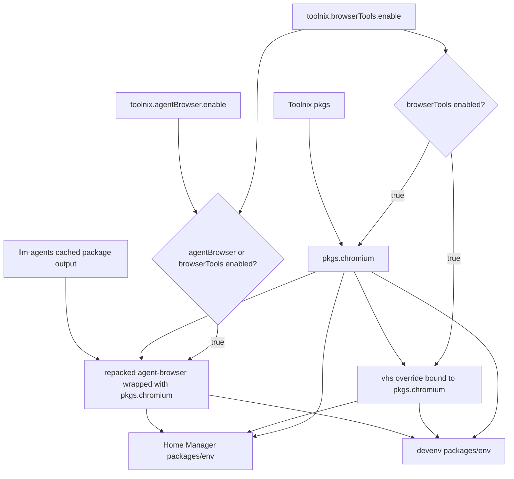

# feat: Add Browser Tools Bundle

## Summary

Implement browser tooling as an opt-in Nix-managed feature path: `toolnix.agentBrowser.enable` will use the Nix-packaged `agent-browser` from `llm-agents.nix` bound to Toolnix `pkgs.chromium`, while `toolnix.browserTools.enable` will add the full `agent-browser` + `vhs` + Chromium bundle across Home Manager and `devenv` profiles.

---

## Problem Frame

The origin requirements define the desired user-facing behavior: browser automation should become declarative and Nix-managed, while Chromium-sized dependencies remain opt-in (see origin: `docs/brainstorms/2026-05-05-browser-tools-requirements.md`). Planning must fit this into Toolnix's existing dendritic flake-parts feature/profile architecture without expanding Compound Engineering defaults.

---

## Requirements

- R1. Replace the lazy npm `toolnix.agentBrowser.enable` implementation with the Nix-packaged `agent-browser` from `llm-agents.nix` (origin R1, R3).
- R2. Configure the Nix-packaged `agent-browser` to use Toolnix `pkgs.chromium` as the browser executable (origin R2, R7).
- R3. Add `toolnix.browserTools.enable` for both Home Manager and project `devenv` consumers (origin R4).
- R4. Make `toolnix.browserTools.enable` provide `agent-browser`, `vhs`, and Chromium, with `browserTools` implying agent-browser behavior (origin R5, R6).
- R5. Preserve light defaults: no Chromium, `vhs`, or agent-browser package when neither browser option is enabled; no `vhs`/Chromium in Compound Engineering helper tools (origin R8, R9).
- R6. Update user-facing documentation and maintainer references to remove npm/browser-download first-run guidance for the Nix-managed path (origin R10).

**Origin actors:** A1 (Toolnix host user), A2 (Project consumer), A3 (Coding agent), A4 (Toolnix maintainer)
**Origin flows:** F1 (Narrow agent-browser enablement), F2 (Full browser tools enablement)
**Origin acceptance examples:** AE1 (covers R1-R3), AE2 (covers R4-R7), AE3 (covers R8-R9)

---

## Scope Boundaries

- Do not make browser tools default-on.
- Do not add `vhs` or Chromium to `toolnix.compoundEngineering.tools.enable`.
- Do not keep the lazy npm wrapper for `toolnix.agentBrowser.enable`.
- Do not force `llm-agents.nix.inputs.nixpkgs.follows = "nixpkgs"` globally.
- Do not share browser profiles, sessions, or state between `agent-browser` and `vhs`; only the browser executable package is shared.
- Do not launch a full browser as part of default evaluation checks.

### Deferred to Follow-Up Work

- Optional fresh-host bootstrap flag for `toolnix.browserTools.enable`: defer until the core Home Manager and `devenv` options are proven, unless the user explicitly requests fresh-host bootstrap coverage in this change.
- Optional wrapped-tool proof app for browser tools: defer until the core Home Manager and `devenv` options are proven.
- Optional Compound Engineering solution note: capture after implementation if the work establishes a reusable pattern for heavy opt-in tool bundles.

---

## Context & Research

### Relevant Code and Patterns

- `modules/shared/agent-browser.nix` currently owns the lazy npm wrapper and first-run env. This should become the narrow Nix-packaged `agent-browser` data provider.
- `flake-parts/features/agent-browser.nix` defines `toolnix.agentBrowser.enable` for Home Manager and `devenv`; use this as the option shape for `browserTools`.
- `flake-parts/profiles/home-manager.nix` and `flake-parts/profiles/devenv.nix` import feature option modules; the new browser-tools feature must be added there.
- `internal/profiles/home-manager/core.nix` and `internal/profiles/devenv/core.nix` compose optional packages and env from feature data; this is where `agentBrowser` and `browserTools` behavior should be combined.
- `modules/shared/compound-engineering.nix` keeps `toolPackages = [ ast-grep silicon ]`; preserve this default-light shape.
- `flake-parts/features/compound-engineering.nix` already has checks asserting `vhs` is absent from the default Compound Engineering tool bundle.
- `README.md`, `docs/reference/architecture.md`, and `docs/reference/maintaining-toolnix.md` still describe the lazy npm first-run/state model and need updates.

### Institutional Learnings

- `docs/solutions/integration-issues/pi-ask-user-compound-tool-2026-04-29.md` highlights that Toolnix-managed agent integrations must be wired through all intended consumption paths and validated with real runtime availability, not just superficial evaluation.

### External References

- `llm-agents.nix` package source: `packages/agent-browser/package.nix`. It accepts `chromium` as a package argument, builds the Rust CLI/dashboard, installs `skills` and `skill-data`, and wraps Linux builds with `AGENT_BROWSER_EXECUTABLE_PATH`.
- nixpkgs `vhs` package source: `pkgs/by-name/vh/vhs/package.nix`. It accepts `chromium` as a package argument and wraps `vhs` with `ffmpeg`, `ttyd`, and Chromium on Linux.

---

## Key Technical Decisions

- Reuse the cached `llm-agents.nix` `agent-browser` executable where available, then repack/patch it so runtime env and embedded share paths point at the Toolnix output and Toolnix `pkgs.chromium`: This preserves the upstream-maintained package while avoiding a local Rust/pnpm rebuild. Fall back to the upstream package definition only when the published package output is unavailable.
- Add a separate `browserTools` feature slice: This matches the dendritic feature/profile layout and keeps the heavy browser bundle separate from both the narrow agent-browser option and Compound Engineering tools. The public semantic contract is “standard heavy browser automation/demo bundle,” currently `agent-browser` + `vhs` + Chromium.
- Keep package construction in shared modules, not profiles: Profiles should combine feature outputs; shared modules should decide which packages/env each feature exposes.
- Prefer explicit effective booleans over option side effects: `browserTools.enable` should imply agent-browser behavior through a single `agentBrowserEffective = agentBrowser.enable || browserTools.enable` composition rule in each profile, without mutating `toolnix.agentBrowser.enable` internally.
- Use evaluation and wrapper smoke checks for default verification, plus a local/manual runtime proof for ordinary `agent-browser` use: CI should prove package presence and Chromium binding cheaply; a real browser launch proof should validate that the upstream runtime contract does not require `agent-browser install`.

---

## Open Questions

### Resolved During Planning

- Should `browserTools` use Toolnix `pkgs.chromium` or `llm-agents.nix`'s Chromium? Resolution: use Toolnix `pkgs.chromium` for both `agent-browser` and `vhs`.
- Should `toolnix.agentBrowser.enable` remain lazy npm? Resolution: no; it should fully switch to the Nix-packaged `agent-browser`.
- Should `browserTools` live under Compound Engineering tools? Resolution: no; keep CE defaults light and expose browser tooling through its own opt-in bundle.

### Deferred to Implementation

- Exact package-construction helper shape: Implementation may choose a shared helper in `modules/shared/browser-tools.nix`, a narrowed `modules/shared/agent-browser.nix` adapter, or a small shared function if that reduces duplication, but the shared modules must accept `inputs` and bind upstream `agent-browser` to Toolnix `pkgs.chromium`.
- Exact check implementation details: Use the most robust cheap check available once the package wrappers are evaluated; wrapper inspection is acceptable when needed to prove Chromium binding without launching a browser.

---

## High-Level Technical Design

> *This illustrates the intended approach and is directional guidance for review, not implementation specification. The implementing agent should treat it as context, not code to reproduce.*

---

## Implementation Units

- U1. **Create browser tool package data**

**Goal:** Replace the lazy npm agent-browser implementation with Nix package data and define the full browser tools bundle around shared `pkgs.chromium`.

**Requirements:** R1, R2, R4

**Dependencies:** None

**Files:**
- Modify: `modules/shared/agent-browser.nix`
- Create: `modules/shared/browser-tools.nix`
- Test: feature checks added in U4

**Approach:**
- Rework `modules/shared/agent-browser.nix` so it exposes Nix-packaged `agent-browser`, not a generated shell wrapper that installs npm state.
- Change browser shared modules to accept the same input context used by other agent modules, including `pkgs`, `lib`, and `inputs`. Resolve inputs with the same fallback pattern used by `modules/shared/agent-baseline.nix` so host and project consumers can evaluate both from direct flake inputs and from `toolnixFlake.devenvSources`.
- Construct `agent-browser` by repacking the cached `inputs.llm-agents.packages.*.agent-browser` output: copy the wrapped executable and share data, patch embedded upstream store-path references to the new output path, and wrap the executable with `AGENT_BROWSER_EXECUTABLE_PATH = pkgs.chromium/bin/chromium`.
- Define the shared data contract explicitly: `agentBrowser.packages` contains only the Nix-packaged `agent-browser`; `browserTools.packages` contains only the additional full-bundle packages (`vhs` and Chromium); profile composition combines them through the effective booleans. This avoids duplicate explicit `agent-browser` package entries when both options are true.
- Define `browserTools` package data around the same `pkgs.chromium`, the Nix-packaged `agent-browser`, and `pkgs.vhs` overridden with that Chromium.
- Keep env focused on runtime paths that remain valid for the Nix-managed path: `AGENT_BROWSER_EXECUTABLE_PATH` and `AGENT_BROWSER_STATE_DIR` are useful; npm prefix/cache variables should disappear.

**Patterns to follow:**
- `modules/shared/compound-engineering.nix` for package data exposed to profile composition.
- `modules/shared/agent-baseline.nix` for resolving flake inputs passed from profiles.

**Test scenarios:**
- Happy path: building/evaluating the narrow agent-browser data produces an `agent-browser` package and an env pointing at `pkgs.chromium`.
- Happy path: building/evaluating browser tools data produces `agent-browser`, `vhs`, and `pkgs.chromium` entries through the shared data contract without duplicate explicit `agent-browser` package entries.
- Edge case: if `llm-agents` input resolution falls back through `toolnixFlake.devenvSources`, the package construction still has access to the published package output or, as a last resort, the upstream package definition.
- Error path: if the upstream `llm-agents.nix` binary layout changes and the executable/share path patch is no longer valid, stop and reconsider an upstream override/overlay instead of silently hardening around a broken internal contract.

**Verification:**
- No npm install wrapper remains in `modules/shared/agent-browser.nix`.
- The package data exposes one Chromium source: Toolnix `pkgs.chromium`.

---

- U2. **Add browserTools feature options**

**Goal:** Add `toolnix.browserTools.enable` for Home Manager and `devenv`, following existing feature option patterns.

**Requirements:** R3, R4

**Dependencies:** U1

**Files:**
- Create: `flake-parts/features/browser-tools.nix`
- Modify: `flake-parts/features/default.nix`
- Modify: `flake-parts/profiles/home-manager.nix`
- Modify: `flake-parts/profiles/devenv.nix`
- Test: feature checks added in U4

**Approach:**
- Add a new flake-parts feature module that publishes browser-tools data and option modules under `toolnix.features.browserTools`.
- Define `toolnix.browserTools.enable` for both Home Manager and `devenv`, defaulting to `false`.
- Import the browser-tools option module in both profile assemblies.

**Patterns to follow:**
- `flake-parts/features/agent-browser.nix` for paired Home Manager and `devenv` option declarations.
- `flake-parts/features/default.nix` for feature module inclusion.

**Test scenarios:**
- Happy path: Home Manager module evaluation accepts `toolnix.browserTools.enable = true`.
- Happy path: `devenv` module evaluation accepts `toolnix.browserTools.enable = true`.
- Edge case: default option remains false in both profiles.

**Verification:**
- New option is available in both host and project module paths.
- Existing `toolnix.agentBrowser.enable` option remains available.

---

- U3. **Wire profile package and env composition**

**Goal:** Make host and project profiles add the correct packages/env for narrow agent-browser and full browserTools modes without duplicates or default closure expansion.

**Requirements:** R1, R2, R3, R4, R5

**Dependencies:** U1, U2

**Files:**
- Modify: `internal/profiles/home-manager/core.nix`
- Modify: `internal/profiles/devenv/core.nix`
- Test: feature checks added in U4

**Approach:**
- In both profiles, compute one effective boolean for agent-browser behavior: `agentBrowserEffective = agentBrowser.enable || browserTools.enable`.
- Add `agentBrowser.packages` when `agentBrowserEffective` is true.
- Add `browserTools.packages` only when `browserTools.enable` is true. Per U1's data contract, this package set contains the additional full-bundle packages (`vhs` and Chromium), not another copy of `agent-browser`.
- Merge browser env after older agent env so browser-specific variables win when both toggles are present.
- Audit current uses of `toolnix.agentBrowser.enable` while implementing. If any current behavior outside profile package/env composition keys directly off that option, route it through the same effective boolean or document why it is intentionally narrow-only.
- Preserve existing Compound Engineering helper-tool package logic unchanged.

**Patterns to follow:**
- Existing optional package composition in `internal/profiles/home-manager/core.nix` and `internal/profiles/devenv/core.nix`.
- Existing `compoundToolsEnabled` gate as an example of keeping tool bundles separate.

**Test scenarios:**
- Covers AE1. Given only `toolnix.agentBrowser.enable = true`, package composition includes `agent-browser`, excludes `vhs`, and sets the agent-browser executable path to Toolnix `pkgs.chromium`.
- Covers AE2. Given only `toolnix.browserTools.enable = true`, package composition includes `agent-browser`, `vhs`, and Chromium through effective agent-browser behavior.
- Covers AE3. Given default Compound Engineering with neither browser option enabled, package composition does not include `vhs` or Chromium through browser tooling.
- Edge case: if both browser options are true, package composition does not require duplicate explicit agent-browser entries.

**Verification:**
- Host and `devenv` profiles produce the same option semantics.
- No profile installs `vhs` unless `toolnix.browserTools.enable` is true.

---

- U4. **Add flake checks for browser tooling behavior**

**Goal:** Prove the important package-selection invariants with cheap evaluation/build checks.

**Requirements:** R1, R2, R4, R5

**Dependencies:** U1, U2, U3

**Files:**
- Modify: `flake-parts/features/browser-tools.nix`
- Modify: `flake-parts/features/compound-engineering.nix` if extending existing absence checks is simpler than duplicating them
- Test: `flake-parts/features/browser-tools.nix`

**Approach:**
- Add checks that instantiate Home Manager configurations with default settings, narrow agent-browser enabled, and browserTools enabled.
- Add equivalent checks for the `devenv` profile path so project-shell packages/env cannot drift from Home Manager behavior.
- Assert default host and project package composition excludes `vhs` and browser tooling.
- Assert narrow agent-browser host and project package composition includes the Nix `agent-browser` package and excludes `vhs`.
- Assert browserTools host and project package composition includes `agent-browser`, `vhs`, and `pkgs.chromium`.
- Add a required non-launching binding proof for Chromium: either inspect generated wrappers for the expected `pkgs.chromium` store path or assert through another robust derivation-level mechanism. Package presence alone is not enough.
- Add a cheap command-level smoke check for `agent-browser --version` and `vhs --version` only if it does not trigger browser launch or heavy runtime behavior.
- Add a local/manual runtime proof note or check target for a minimal ordinary `agent-browser` command that launches through the Nix-managed Chromium. This proof can be outside default CI if too heavy, but it must be recorded in the devlog before declaring the migration done.

**Patterns to follow:**
- `flake-parts/features/compound-engineering.nix` checks for default tool inclusion and `vhs` exclusion.

**Test scenarios:**
- Happy path: `nix flake check --no-build` evaluates browser-tools checks.
- Happy path: targeted browser-tools checks can be built without launching Chromium.
- Happy path: Home Manager and `devenv` checks agree on option semantics for default, narrow, and full bundle modes.
- Error path: if default configuration accidentally pulls `vhs`, checks fail with a clear message.
- Error path: if browserTools does not pull `vhs` or `agent-browser`, checks fail with a clear message.
- Error path: if either `agent-browser` or `vhs` is bound to a Chromium other than Toolnix `pkgs.chromium`, targeted binding checks fail with a clear message.

**Verification:**
- Checks cover the origin acceptance examples at the package-selection level.
- Existing Compound Engineering default-light check still passes.

---

- U5. **Update documentation and first-run guidance**

**Goal:** Replace stale lazy npm guidance with the new Nix-managed browser tooling story.

**Requirements:** R6

**Dependencies:** U1, U2, U3

**Files:**
- Modify: `README.md`
- Modify: `docs/reference/architecture.md`
- Modify: `docs/reference/maintaining-toolnix.md`
- Create: `docs/devlog/2026-05-05-browser-tools.md`

**Approach:**
- Update project-consumer examples to show both narrow `toolnix.agentBrowser.enable = true` and full `toolnix.browserTools.enable = true`.
- Remove references to npm prefix/cache and `agent-browser install` as normal first-run steps.
- Document that Chromium is Nix-managed and shared by `agent-browser` and `vhs` when browserTools is enabled.
- Update state-location docs to keep `~/.agent-browser` as runtime state while removing npm cache/prefix state from the managed Toolnix path.
- Add migration notes for existing users of the lazy npm wrapper: how to confirm the active binary, which old npm prefix/cache paths are safe cleanup targets, and whether existing `~/.agent-browser` runtime state is expected to be preserved.
- Record the behavior change in a devlog, including the intentional closure trade-off, the runtime proof outcome, and the preservation of light defaults.

**Patterns to follow:**
- `docs/devlog/2026-03-28-agent-browser-opt-in-module.md` for previous behavior and historical rationale.
- `docs/devlog/2026-05-04-compound-engineering-helper-tools.md` for closure-weight rationale around `vhs`.

**Test scenarios:**
- Documentation review: README no longer tells Nix-managed users to run `agent-browser install`.
- Documentation review: docs distinguish narrow agent-browser from full browserTools.
- Documentation review: docs state that browserTools is opt-in and not part of default Compound Engineering tools.
- Documentation review: migration notes explain old npm-managed paths without implying Toolnix still uses them.

**Verification:**
- User-facing docs match actual option behavior after U3.
- Maintainer docs point future changes at the new browser-tools module/feature.

---

## System-Wide Impact

- **Interaction graph:** Feature data flows from `modules/shared/*` into `flake-parts/features/*`, then into Home Manager and `devenv` profiles. This change touches both host and project consumption paths.
- **Error propagation:** Package-construction failures should surface at Nix evaluation/build time, not as runtime npm failures.
- **State lifecycle risks:** Existing host-local npm prefix/cache directories may remain on machines from the old wrapper but should no longer be referenced by Toolnix docs or env. Documentation should explain safe cleanup and active-binary verification for migrated users.
- **API surface parity:** `toolnix.agentBrowser.enable` stays stable; `toolnix.browserTools.enable` becomes the new heavy bundle option in both module families.
- **Integration coverage:** Package-selection checks should cover host profile behavior; `devenv shell -- true` should cover project-shell evaluation.
- **Unchanged invariants:** Compound Engineering helper tools remain `ast-grep` and `silicon` only; browser tooling remains opt-in.

---

## Risks & Dependencies

| Risk | Mitigation |
|------|------------|
| Rebinding the upstream `agent-browser` package to Toolnix `pkgs.chromium` causes a local source build or cache miss. | Avoid the rebuild on the common path by repacking the cached upstream executable and wrapping it with Toolnix `pkgs.chromium`; fall back to source packaging only if the published package output is unavailable. |
| Directly using the prebuilt `llm-agents` output accidentally pulls a second Chromium. | Do not expose the prebuilt package directly. Copy its executable/share payload into a new output, patch embedded package paths, and wrap with Toolnix `pkgs.chromium` so the final output does not reference `llm-agents` Chromium. |
| Documentation still mentions `agent-browser install`, causing users to download Chrome unnecessarily. | Make documentation updates part of the same implementation and verify by searching docs for stale guidance. |
| Default closure grows unexpectedly. | Add checks for default package absence and keep browserTools default false. Also avoid eager browser derivation construction on default profile evaluation where practical. |
| Check implementation proves package presence but not actual Chromium binding. | Add targeted non-launching wrapper/binding checks for the expected `pkgs.chromium` path and keep `--version` checks as smoke only. |
| Nix-managed `AGENT_BROWSER_EXECUTABLE_PATH` does not fully replace upstream first-run runtime behavior. | Run and document a local/manual minimal ordinary `agent-browser` runtime proof before declaring the migration complete. |

---

## Documentation / Operational Notes

- The old npm-managed state paths may remain on existing hosts and can be cleaned manually, but the new Nix-managed path should not depend on them.
- The normal first-run flow for Nix-managed `agent-browser` should be `agent-browser --version` followed by ordinary commands, not `agent-browser install`.
- `vhs` remains a browserTools feature, not a Compound Engineering helper-tool default.

---

## Sources & References

- **Origin document:** [docs/brainstorms/2026-05-05-browser-tools-requirements.md](../brainstorms/2026-05-05-browser-tools-requirements.md)
- Architecture reference: [docs/reference/architecture.md](../reference/architecture.md)
- Maintainer reference: [docs/reference/maintaining-toolnix.md](../reference/maintaining-toolnix.md)
- Existing agent-browser feature: `flake-parts/features/agent-browser.nix`
- Existing agent-browser shared module: `modules/shared/agent-browser.nix`
- Home Manager profile composition: `internal/profiles/home-manager/core.nix`
- `devenv` profile composition: `internal/profiles/devenv/core.nix`
- Compound Engineering helper tools: `modules/shared/compound-engineering.nix`
- Compound Engineering checks: `flake-parts/features/compound-engineering.nix`
- Bootstrap script: `scripts/bootstrap-home-manager-host.sh`
