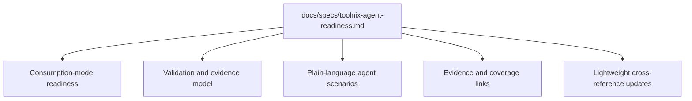

# Add Toolnix Agent Readiness Spec

## Summary

Create a Toolnix-native readiness spec under `docs/specs/` and connect it lightly to existing reference docs. The plan adapts the Hackbox readiness pattern into Toolnix consumption modes, adds reader-facing Mermaid diagrams, and links existing evidence without adding new validation tooling.

---

## Problem Frame

Toolnix needs one canonical readiness contract that agents can follow and humans can understand. The origin requirements define the product scope; this plan defines the documentation work needed to land that contract.

---

## Requirements

- R1. The implementation must create a Toolnix-native readiness spec organized by Toolnix consumption modes rather than Hackbox inventory roles.
- R2. The spec must include plain-language scenarios that a verification agent can follow for Toolnix-managed VMs and project shells.
- R3. The spec must be readable for a human who knows Toolnix but not Hackbox.
- R4. Each readiness area must distinguish deterministic smoke checks, interactive agent acceptance, mixed validation, and unavailable coverage.
- R5. The spec must define evidence status vocabulary for pass, fail, blocked, not applicable, and not covered outcomes.
- R6. The spec must distinguish readiness expectations from collected evidence so diagnostic output, transcripts, and devlogs do not silently become authoritative pass/fail verifiers.
- R7. The spec must link existing scripts, specs, plans, references, and devlogs where they provide current evidence or historical context.
- R8. The spec must include conceptual Mermaid diagrams for consumption-mode applicability and validation/evidence flow.
- R9. The implementation must keep optional features optional, especially `agent-browser` and host-control helpers.
- R10. The implementation must not import Hackbox inventory, `target-entry`, or fleet-control behavior into default Toolnix readiness.

**Origin actors:** A1 Maintainer, A2 Verification agent, A3 Human reader, A4 Project consumer
**Origin flows:** F1 Agent verifies a Toolnix VM or project shell, F2 Reader learns the Toolnix readiness model
**Origin acceptance examples:** AE1 mode identification, AE2 validation-mode distinction, AE3 diagram/prose consistency, AE4 optional host-control separation

---

## Scope Boundaries

- Do not add new Nix modules, wrappers, validation scripts, CI jobs, or conformance-suite tooling.
- Do not edit Hackbox docs.
- Do not copy Hackbox inventory/control-host scenarios verbatim.
- Do not require all Toolnix-configured Linux machines to become full NixOS hosts.
- Do not solve current `agent-browser` versus future browser-tooling implementation details in this spec.
- Do not rewrite `docs/reference/architecture.md`; only add lightweight links or references if they improve discoverability.

### Deferred to Follow-Up Work

- Automated readiness runner or conformance suite: possible future work after the spec defines the contract.
- CI integration for readiness checks: possible future work if deterministic smoke checks are later consolidated.
- Browser-tool-specific readiness commands: defer to the active browser-tooling plan and current implementation docs.

---

## Context & Research

### Relevant Code and Patterns

- `STRATEGY.md` names agent-native verification docs as an active track and explicitly mentions porting checks from `lefant/hackbox-ctrl`.
- `docs/reference/architecture.md` is the current source for Toolnix public interfaces, module layering, and host-vs-project responsibility boundaries.
- `docs/specs/fresh-environment-bootstrap.md` already frames fresh-environment bootstrap behavior and wrapped-tool proof expectations.
- `docs/specs/llm-agents-cache-bootstrap.md` covers cache/bootstrap readiness constraints that should appear in fresh-host readiness.
- `docs/reference/maintaining-toolnix.md` documents local smoke-test style and should be linked where current maintenance workflows are relevant.
- `scripts/bootstrap-home-manager-host.sh` prints a readiness summary, but that output is diagnostic evidence rather than a strict pass/fail verifier.
- `scripts/check-opinionated-zsh.sh` and `scripts/check-opinionated-tmux.sh` are current deterministic checks for opinionated shell/tmux readiness.
- `docs/plans/2026-03-30-wrapped-tool-proofs.md` and `docs/plans/2026-04-05-exe-vm-bootstrap-proof.md` provide prior proof framing for wrapped tools and fresh exe.dev VM bootstrap.
- `docs/reference/architecture.md` documents current browser capability boundaries, so readiness wording should remain capability-level instead of hard-coding first-run commands.

### Institutional Learnings

- Prior Mermaid research in `docs/research/2026-04-15-mitsuhiko-agent-stuff-pi-extension-and-skill-notes.md` and `docs/research/2026-04-16-agent-stuff-shortlist-follow-up.md` supports drafting Mermaid diagrams separately and validating them before embedding.
- The repo already uses Mermaid in `docs/reference/architecture.md`, so a readiness spec can follow that visual-doc pattern.

### External References

- External web research was unavailable in the current agent environment. Local architecture, strategy, and the Hackbox pattern already captured in the origin brainstorm are sufficient for this docs-only plan.

---

## Key Technical Decisions

- New spec filename: create `docs/specs/toolnix-agent-readiness.md`. The name is explicit, discoverable, and aligned with the origin topic.
- Consumption-mode structure: organize the spec around Toolnix interfaces and responsibility boundaries, not deployment roles copied from Hackbox.
- Evidence vocabulary: include `pass`, `fail`, `blocked`, `not applicable`, and `not covered` so agents can report credential-dependent or optional-feature checks without false failures.
- Credential-sensitive checks: treat live model prompts, provider access, and auth-dependent agent behavior as conditional interactive acceptance rather than deterministic smoke failures.
- Readiness versus evidence: keep expected state separate from proof artifacts so diagnostic output, transcripts, and devlogs support but do not replace readiness requirements.
- Bootstrap readiness summary: describe `scripts/bootstrap-home-manager-host.sh` readiness output as diagnostic evidence, not a strict verifier.
- Optional browser readiness: describe browser automation capability readiness without hard-coding first-run commands that may change under the browser-tools plan.
- Host-control boundary: v1 may state that host-control is opt-in, but should not define readiness scenarios for inventory-specific `target-entry` or `targets` flows.
- Diagram posture: Mermaid diagrams are explanatory and conceptual; prose remains authoritative.

---

## Open Questions

### Resolved During Planning

- Filename for the new spec: use `docs/specs/toolnix-agent-readiness.md`.
- Required Mermaid diagrams for v1: include a consumption-mode applicability diagram and a validation/evidence flow diagram.
- Readiness status vocabulary: use `pass`, `fail`, `blocked`, `not applicable`, and `not covered`.

### Deferred to Implementation

- Exact readiness scenario wording: refine while adapting the Hackbox source into Toolnix concepts.
- Exact evidence-table rows: finalize while reading the linked scripts/docs and avoiding stale devlog claims.
- Mermaid rendering details: validate standalone drafts during implementation before embedding final blocks.

---

## High-Level Technical Design

> *This illustrates the intended approach and is directional guidance for review, not implementation specification. The implementing agent should treat it as context, not code to reproduce.*

---

## Implementation Units

- U1. **Create the Toolnix readiness spec skeleton**

**Goal:** Establish the new canonical readiness document with purpose, source context, scope boundaries, status vocabulary, and Toolnix consumption-mode framing.

**Requirements:** R1, R3, R5, R10; origin A3, AE1, AE4

**Dependencies:** None

**Files:**
- Create: `docs/specs/toolnix-agent-readiness.md`
- Test: none

**Approach:**
- Start from the Hackbox readiness spec pattern, but rewrite the framing around Toolnix public consumption modes and module/profile boundaries.
- Include a short “what this is not” note so readers do not infer Hackbox inventory ownership or mandatory host-control behavior.
- Define the readiness status vocabulary before any scenarios so agent reports have consistent states.

**Patterns to follow:**
- `docs/specs/fresh-environment-bootstrap.md` for spec-style scenario language.
- `docs/reference/architecture.md` for Toolnix interface and responsibility names.

**Test scenarios:**
- Test expectation: none -- docs-only scaffold. Verification is review-based.

**Verification:**
- A reader can identify the spec’s purpose, supported consumption modes, status vocabulary, and non-goals before reaching detailed scenarios.

---

- U2. **Add Mermaid diagrams and applicability model**

**Goal:** Make the readiness model understandable at a glance through conceptual Mermaid diagrams and a concise applicability table or equivalent prose.

**Requirements:** R1, R3, R7; origin F2, AE1, AE3

**Dependencies:** U1

**Files:**
- Modify: `docs/specs/toolnix-agent-readiness.md`
- Test: standalone Mermaid drafts under `/tmp` during implementation, not committed unless useful

**Approach:**
- Add a consumption-mode applicability diagram covering host-only bootstrap/Home Manager host, project `devenv` shell, wrapped runtime proofs, and optional features.
- Add a validation/evidence flow diagram showing how scenarios route to smoke checks, interactive acceptance, blocked states, and evidence reporting.
- Keep diagrams conceptual and narrow; make surrounding prose authoritative.

**Patterns to follow:**
- Existing Mermaid style in `docs/reference/architecture.md`.
- Mermaid validation guidance from `docs/research/2026-04-15-mitsuhiko-agent-stuff-pi-extension-and-skill-notes.md` and `docs/research/2026-04-16-agent-stuff-shortlist-follow-up.md`.

**Test scenarios:**
- Happy path: Mermaid drafts parse/render successfully before embedded blocks are finalized.
- Integration: Diagram labels match the prose sections they summarize and do not introduce readiness obligations absent from prose.

**Verification:**
- The embedded diagrams render in Markdown tooling and improve scanability without contradicting prose.

---

- U3. **Adapt readiness areas and agent acceptance scenarios**

**Goal:** Fill the spec with Toolnix-native readiness areas and plain-language scenarios that a verification agent can execute or report against.

**Requirements:** R2, R4, R5, R6, R9, R10; origin A2, A4, F1, AE2, AE4

**Dependencies:** U1, U2

**Files:**
- Modify: `docs/specs/toolnix-agent-readiness.md`
- Test: none

**Approach:**
- Cover the main readiness areas: fresh/host-only bootstrap, Home Manager host profile, project `devenv` shell, wrapped `toolnix-pi`/`toolnix-tmux` proofs, optional browser capability, and optional host-control helpers.
- For each area, state validation preference: smoke, interactive acceptance, mixed, or not covered.
- Make credential-backed live agent checks conditional and reportable as `blocked` when local auth/provider state is missing.
- Keep project-shell readiness limited to shell-local behavior unless Home Manager host state is explicitly in scope.
- Keep `tmux-meta` distinct from inventory-specific host-control behavior.
- For host-control v1, stop at the opt-in capability boundary; do not add readiness scenarios for inventory-specific wrappers.

**Patterns to follow:**
- Source pattern: the Hackbox readiness split captured in the origin brainstorm, adapted into Toolnix terms.
- Toolnix boundary source: `docs/reference/architecture.md`.
- Credential boundary source: `docs/reference/credentials.md`.

**Test scenarios:**
- Covers AE2. Given an agent verifies a Toolnix-managed VM, the spec lets it determine which checks are smoke checks, which are interactive acceptance, and which are blocked by credentials.
- Covers AE4. Given optional host-control or browser capability is disabled, absence is not reported as a readiness failure.
- Edge case: Given only a project `devenv` shell is in scope, the spec does not require persistent Home Manager-managed agent dotfiles.

**Verification:**
- A verification agent can follow the scenarios and produce a report with pass/fail/blocked/not-applicable/not-covered states.

---

- U4. **Add evidence traceability and existing artifact links**

**Goal:** Connect readiness areas to current Toolnix evidence sources and coverage gaps without letting evidence artifacts replace the readiness expectations themselves.

**Requirements:** R4, R5, R6, R7; origin F1, AE2

**Dependencies:** U3

**Files:**
- Modify: `docs/specs/toolnix-agent-readiness.md`
- Test: none

**Approach:**
- Add an evidence/coverage table with columns such as readiness area, expected state, validation preference, existing evidence, and coverage gap.
- Link current references, scripts, specs, and plans where they support readiness claims.
- Use devlogs as historical context only when they help explain provenance; prefer current reference/spec/script files for authoritative behavior.
- Explicitly label `scripts/bootstrap-home-manager-host.sh` readiness output as diagnostic evidence rather than a strict verifier.

**Patterns to follow:**
- Current docs: `docs/reference/architecture.md`, `docs/reference/maintaining-toolnix.md`, `docs/reference/credentials.md`.
- Current specs/plans: `docs/specs/fresh-environment-bootstrap.md`, `docs/specs/llm-agents-cache-bootstrap.md`, `docs/plans/2026-03-30-wrapped-tool-proofs.md`, `docs/plans/2026-04-05-exe-vm-bootstrap-proof.md`.
- Current scripts: `scripts/bootstrap-home-manager-host.sh`, `scripts/check-opinionated-zsh.sh`, `scripts/check-opinionated-tmux.sh`.

**Test scenarios:**
- Happy path: Each major readiness area has either current evidence links or an explicit coverage gap.
- Edge case: Historical devlogs are not presented as current authoritative requirements.

**Verification:**
- A maintainer can scan the table and see what is covered by existing checks, what requires interactive acceptance, and what remains future work.

---

- U5. **Wire discoverability from existing docs**

**Goal:** Make the new readiness spec discoverable from the repo’s existing strategy and architecture/reference entry points without rewriting them.

**Requirements:** R3, R7; origin A1, A3, F2

**Dependencies:** U1, U4

**Files:**
- Modify: `docs/reference/architecture.md`
- Modify: `STRATEGY.md`
- Modify: `AGENTS.md` if a short “Start Here” link is warranted
- Test: none

**Approach:**
- Add lightweight references to the new readiness spec where readers already look for architecture and strategy grounding.
- Keep edits small and link-oriented; do not duplicate the readiness content in reference docs.
- Consider whether `AGENTS.md` should include the new spec in “Start Here” once the spec exists.

**Patterns to follow:**
- Existing “Start Here” and cross-reference style in `AGENTS.md` and `docs/reference/architecture.md`.

**Test scenarios:**
- Happy path: A reader starting from architecture or strategy can find the readiness spec.
- Edge case: Existing architecture prose is not rewritten into a second readiness spec.

**Verification:**
- Cross-links are present, concise, and point to the new spec using repo-relative Markdown links.

---

## System-Wide Impact

- **Interaction graph:** Docs-only change. It affects documentation navigation and agent handoff quality, not runtime behavior.
- **Error propagation:** Not applicable to runtime. Documentation should help agents report verification states clearly.
- **State lifecycle risks:** Main risk is stale documentation if optional browser tooling changes; mitigate with capability-level wording and links to current implementation docs.
- **API surface parity:** No public Nix API changes.
- **Integration coverage:** Review should confirm that origin R/F/AE requirements are represented in the new spec and links.
- **Unchanged invariants:** Toolnix defaults remain separate from opt-in host-control and optional browser capabilities.

---

## Risks & Dependencies

| Risk | Mitigation |
|------|------------|
| Hackbox inventory concepts leak into Toolnix defaults | Organize by Toolnix consumption modes, explicitly mark host-control as opt-in, and avoid v1 scenarios for inventory-specific wrappers |
| Diagrams drift from prose | Validate Mermaid syntax and review diagrams against prose authority |
| Readiness claims become stale | Prefer current reference/spec/script links; label devlogs as historical evidence |
| Credential-dependent checks produce false failures | Use `blocked` for missing local auth/provider state |
| Browser readiness wording becomes stale during browser-tools migration | Keep optional browser readiness capability-level and link to current implementation docs |

---

## Documentation / Operational Notes

- This is a documentation-only plan. No runtime rollout is required.
- Mermaid diagrams should be drafted and validated before embedding final blocks.
- The new spec should improve future implementation and verification work, but it does not itself prove environments ready.

---

## Sources & References

- **Origin document:** [docs/brainstorms/2026-05-04-toolnix-agent-readiness-requirements.md](../brainstorms/2026-05-04-toolnix-agent-readiness-requirements.md)
- **Strategy:** [STRATEGY.md](../../STRATEGY.md)
- **Architecture:** [docs/reference/architecture.md](../reference/architecture.md)
- **Credentials:** [docs/reference/credentials.md](../reference/credentials.md)
- **Maintaining Toolnix:** [docs/reference/maintaining-toolnix.md](../reference/maintaining-toolnix.md)
- **Fresh environment bootstrap spec:** [docs/specs/fresh-environment-bootstrap.md](../specs/fresh-environment-bootstrap.md)
- **LLM agents cache bootstrap spec:** [docs/specs/llm-agents-cache-bootstrap.md](../specs/llm-agents-cache-bootstrap.md)
- **Wrapped tool proofs plan:** [docs/plans/2026-03-30-wrapped-tool-proofs.md](2026-03-30-wrapped-tool-proofs.md)
- **exe VM bootstrap proof plan:** [docs/plans/2026-04-05-exe-vm-bootstrap-proof.md](2026-04-05-exe-vm-bootstrap-proof.md)
- **Bootstrap script:** [scripts/bootstrap-home-manager-host.sh](../../scripts/bootstrap-home-manager-host.sh)
- **Opinionated zsh check:** [scripts/check-opinionated-zsh.sh](../../scripts/check-opinionated-zsh.sh)
- **Opinionated tmux check:** [scripts/check-opinionated-tmux.sh](../../scripts/check-opinionated-tmux.sh)
