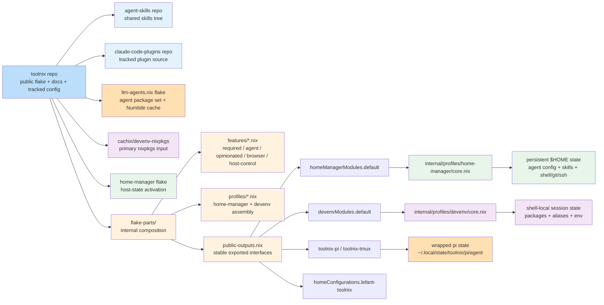

# Toolnix Architecture

This document describes the current self-hosted architecture of `toolnix` after the removal of the previous imperative setup-hook path.

For the migration sequence and intermediate steps, see:

- [`docs/plans/2026-03-28-remove-imperative-setup-hook.md`](../plans/2026-03-28-remove-imperative-setup-hook.md)

Key architecture decisions:

- [`docs/decisions/2026-03-30_adopt-flake-parts-for-toolnix.md`](../decisions/2026-03-30_adopt-flake-parts-for-toolnix.md)
- [`docs/decisions/2026-03-30_adopt-dendritic-feature-profile-layout.md`](../decisions/2026-03-30_adopt-dendritic-feature-profile-layout.md)
- [`docs/decisions/2026-03-30_export-wrapped-tmux-and-pi-proofs.md`](../decisions/2026-03-30_export-wrapped-tmux-and-pi-proofs.md)
- [`docs/decisions/2026-04-05_use-public-resource-flake-inputs.md`](../decisions/2026-04-05_use-public-resource-flake-inputs.md)
- [`docs/decisions/2026-04-05_use-remote-flake-bootstrap-for-toolnix.md`](../decisions/2026-04-05_use-remote-flake-bootstrap-for-toolnix.md)

## Repos and flake/component map

## Flake Outputs

`flake.nix` is now constructed with internal `flake-parts` composition.

The current architecture uses a dendritic-style internal layout:

- flake-parts feature modules publish the current A/R/O/H slices into a merged internal registry
- flake-parts profile modules assemble Home Manager and `devenv` from that registry
- published output names and public module paths remain stable through compatibility wrappers

For fresh-machine bootstrap, the default published interface is remote flake consumption of `github:lefant/toolnix` rather than a pre-cloned working copy on the target machine.

`flake.nix` exposes three primary interfaces:

- `homeConfigurations.lefant-toolnix`
  - self-hosted Home Manager configuration for the current toolnix host
- `homeManagerModules.default`
  - reusable Home Manager module export for toolnix host configuration
- `devenvModules.default`
  - reusable `devenv` module export for project shells

The repo also exports `devenvSources`, which centralizes the shared flake inputs used by the toolnix `devenv` layer.

Current stable bootstrap-oriented interfaces are:

- direct remote flake use such as `nix run --accept-flake-config github:lefant/toolnix#toolnix-pi`
- `homeManagerModules.default`
- `devenvModules.default`
- the wrapped-tool package/app outputs exported by the flake

As additive wrapped-tool proofs, the flake also exports portable package/app entries for:

- `toolnix-tmux`
- `toolnix-pi`

## Module Layering

`toolnix` is structured around shared layers in `modules/shared/`:

- `required-baseline.nix`
  - mandatory baseline packages and locale environment
- `opinionated-shell.nix`
  - interactive shell defaults such as aliases, tmux helpers, prompt setup, and shell ergonomics
- `agent-baseline.nix`
  - shared AI-agent tool packages plus the managed skills tree used by the host configuration
- `agent-browser.nix`
  - optional host-native browser automation support
- `host-control.nix`
  - optional control-host helpers kept outside the main baseline

These layers are assembled in two main entry modules:

- `modules/home-manager/toolnix-host.nix`
  - compatibility wrapper for the published Home Manager module path
- `modules/devenv/default.nix`
  - project and self-hosted `devenv` shell environment

The current Home Manager and `devenv` export/build path is internally composed from:

- `flake-parts/toolnix-options.nix`
  - declares the merged internal registries for `toolnix.internal`, `toolnix.features`, and `toolnix.profiles`
- `flake-parts/features/*.nix`
  - publish the current A/R/O/H slices into the feature registry
- `flake-parts/profiles/*.nix`
  - assemble the Home Manager and `devenv` default profiles from the feature registry
- `flake-parts/public-outputs.nix`
  - wires the stable public outputs from the merged profile registry
- `internal/profiles/home-manager/core.nix`
  - holds the non-wrapper Home Manager profile glue
- `internal/profiles/devenv/core.nix`
  - holds the non-wrapper `devenv` profile glue
- `modules/home-manager/toolnix-host.nix`
  - forwards legacy call sites to the flake-parts-owned exported Home Manager module
- `modules/devenv/default.nix`
  - forwards legacy call sites to the flake-parts-owned exported `devenv` module

## Host vs Project Responsibilities

### Home Manager host

The Home Manager host module owns persistent user-facing configuration under `$HOME`, including:

- shell and tmux config
- git and SSH config
- persistent agent config files
- shared skill directory wiring
- session-level environment variables
- `.claude.json` merge/seed activation behavior

This is the declarative owner of persistent self-hosted runtime state.

### Project / self-hosted devenv shell

The `devenv` module owns shell-local behavior only, including:

- packages available in the shell
- shell-local environment variables
- interactive aliases and helper functions
- editor defaults
- optional project-shell features such as `agent-browser`

`devenv` shapes the active shell session and does not perform persistent home-directory provisioning.

## Runtime Configuration Model

The self-hosted runtime model is now split cleanly between declarative host state and shell-local behavior.

### Declarative host-managed runtime state

Persistent agent configuration is managed through Home Manager file entries sourced from the repo:

- `~/.claude/settings.json`
- `~/.codex/config.toml`
- `~/.config/opencode/opencode.json`
- `~/.config/amp/settings.json`
- `~/.openclaw/openclaw.json`
- `~/.pi/agent/settings.json`
- `~/.pi/agent/keybindings.json`

Shared skills are also managed declaratively:

- `~/.agents/skills`
- `~/.claude/skills`
- `~/.config/opencode/skills`
- `~/.config/amp/skills`
- `~/.openclaw/skills`
- `~/.pi/agent/skills`

These are wired from the managed skill tree exported by `modules/shared/agent-baseline.nix`.

### Activation-time merge behavior

`~/.claude.json` remains handled by a Home Manager activation step that merges the tracked template with any existing local file.

This is the remaining activation-time runtime merge behavior kept on the host side.

## Optional Features

### Opinionated shell layer

The project-shell path exposes toggleable opinionated features under `toolnix.opinionated.*`, with a top-level enable/disable switch.

These toggles control:

- timezone defaults
- aliases
- tmux helpers
- agent wrapper aliases

### Agent browser

`agent-browser` is opt-in for both host and project contexts through:

- `toolnix.agentBrowser.enable = true;`

It provides a host-native wrapper and stores runtime state in user-local paths.

### Host control helpers

Host-control behavior is isolated behind:

- `toolnix.enableHostControl = true;`

This keeps control-host inventory workflows outside the default toolnix environment.

## State Locations

### Declarative repo-managed sources

Tracked sources live in this repo under:

- `agents/`
- `modules/`
- `home-manager/files/`
- `docs/`

### Persistent user state

Persistent user state lives under `$HOME`, including:

- shell dotfiles managed by Home Manager
- agent configuration under locations such as `~/.claude/`, `~/.codex/`, `~/.config/opencode/`, `~/.config/amp/`, `~/.openclaw/`, and `~/.pi/agent/`
- shared user skills under `~/.agents/skills`
- browser automation state under `~/.agent-browser` and related cache/prefix directories when `agent-browser` is enabled
- environment secrets loaded from `~/.env.toolnix` or the legacy fallback `~/.env.toolbox`

## What Was Removed

The previous imperative setup-hook path has been removed from the self-hosted architecture.

That means the current architecture does not rely on:

- shell-entry mutation of persistent runtime state
- Docker-era `/opt/...` setup defaults
- Docker mount writability checks
- plugin marketplace installation during shell startup
- compound-engineering converted asset installation during shell startup
