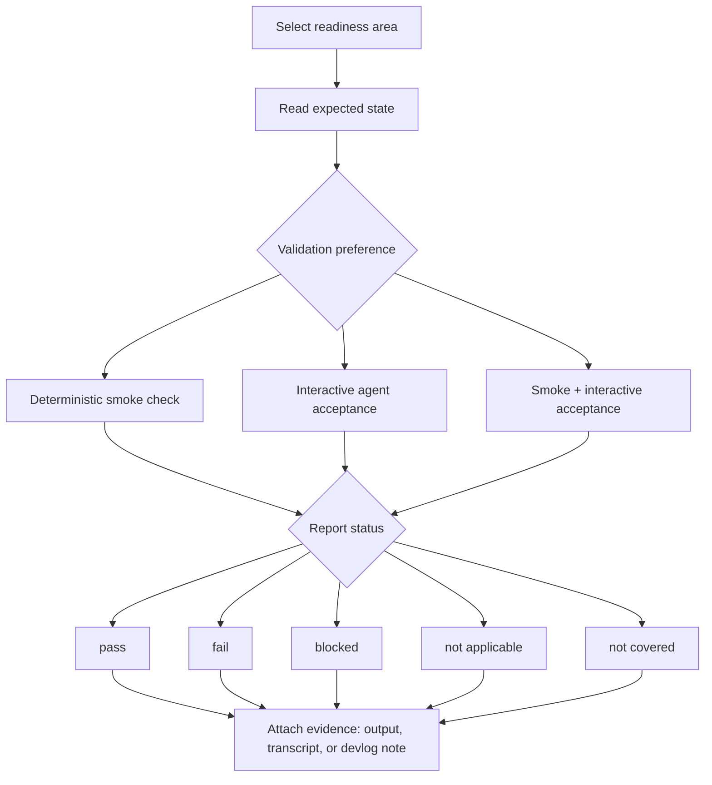
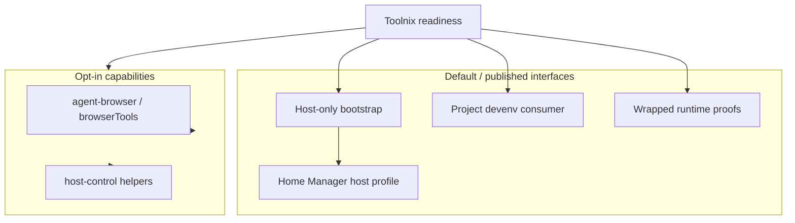

# Toolnix Agent Readiness

## Purpose

Define what it means for a Toolnix environment to be ready for agent-native coding.

This spec is written for two readers:

- a verification agent that needs plain-language scenarios it can execute or report against
- a human reader who needs to understand Toolnix readiness without knowing Hackbox inventory/control-host concepts

The source pattern is the Hackbox readiness split between deterministic smoke checks and interactive acceptance checks. This spec adapts that pattern to Toolnix consumption modes and keeps Toolnix-specific boundaries authoritative.

## What this is not

This spec does not:

- turn Hackbox inventory workflows into Toolnix defaults
- require every Toolnix-configured Linux machine to be NixOS
- require optional features such as browser automation or host-control helpers unless they are explicitly enabled
- define a full conformance test runner or CI suite
- treat diagnostic output, transcripts, or devlogs as replacements for readiness requirements

## Readiness status vocabulary

Agents and operators should report each check with one of these states:

- **pass** - the expected state was observed
- **fail** - the expected state was checked and was not observed
- **blocked** - the environment may be structurally ready, but the check depends on unavailable local auth, credentials, provider state, network access, or another external prerequisite
- **not applicable** - the readiness area does not apply to the selected consumption mode or disabled optional feature
- **not covered** - the spec names the expectation, but no current smoke check or interactive acceptance procedure is documented yet

## Validation model

Readiness evidence comes from two complementary modes.

- **Deterministic smoke checks** cover fast, repeatable checks suitable for local maintenance, bootstrap proof, or future automation.
- **Interactive agent acceptance** covers session-shaped behavior that is better validated by a coding agent or operator through SSH, shell, tmux, and live agent interaction.

Some areas are **mixed**: smoke checks can prove structure, while interactive acceptance proves usability. When this spec names an expectation but no current procedure is documented, the validation preference is **not covered** and agents should report the status as **not covered** until a smoke check or interactive acceptance path exists.

Readiness expectations and evidence are separate. A script output, transcript, or devlog can support a readiness claim, but the prose requirements in this spec define the expected state.

Prose is authoritative. Diagrams summarize the model for readability and must not be read as adding requirements that the prose does not state.

## Consumption modes

Toolnix readiness is organized by consumption mode, not by Hackbox machine role.

| Consumption mode | Stable interface | Expected baseline | Notes |
| --- | --- | --- | --- |
| Host-only bootstrap | `scripts/bootstrap-home-manager-host.sh` consuming `homeManagerModules.default` | Persistent Home Manager-managed host state | Does not require a target-side Toolnix clone for normal bootstrap. |
| Home Manager host profile | `homeManagerModules.default` / `homeConfigurations.lefant-toolnix` | Persistent shell, tmux, git/SSH wiring, agent config, managed skills | Owns host state under `$HOME`; credentials remain machine-local. |
| Project devenv consumer | `devenvModules.default` / `modules/devenv/project.nix` | Shell-local packages, aliases, env, and optional project features | Does not provision persistent agent dotfiles by itself. |
| Wrapped runtime proofs | `toolnix-pi`, `toolnix-tmux` app/package outputs | Portable proof that tracked runtime config can bootstrap outside the normal host profile | Additive proof path, not a replacement for host readiness. |
| Optional browser automation | `toolnix.agentBrowser.enable` and `toolnix.browserTools.enable` | Browser automation capability when explicitly enabled | Absence is not a failure when the feature is disabled. |
| Optional host-control helpers | `toolnix.enableHostControl` | Host-control convenience wrappers when explicitly enabled | Toolnix does not own Hackbox inventory or fleet credentials by default. |

## Readiness areas

### Host-only bootstrap readiness

**Validation preference:** mixed. Cache and structural checks are deterministic; full agent usability may require interactive acceptance.

The host-only bootstrap path SHALL produce the expected Home Manager-managed host state without requiring a checked-out Toolnix repository on the target machine.

**Scenarios:**

- GIVEN a fresh host uses the tracked bootstrap script WHEN bootstrap completes THEN the host has Nix-managed Toolnix state through `homeManagerModules.default`.
- GIVEN a fresh host uses remote flake bootstrap WHEN readiness is checked THEN the bootstrap did not require a target-side clone of `toolnix`.
- GIVEN a fresh host depends on the `llm-agents.nix` stack WHEN cache readiness is checked THEN the Numtide cache prerequisite is active before the host is marked ready.
- GIVEN bootstrap prints a readiness summary WHEN an agent reads that output THEN the output is treated as diagnostic evidence, not as a strict verifier.
- GIVEN agent credentials are absent or expired WHEN live model prompts are attempted THEN structural bootstrap checks may still pass, while credential-backed acceptance is reported as **blocked**.

### Home Manager host profile readiness

**Validation preference:** mixed. Managed files and binaries can be smoke-checked; tmux and live-agent usability require interactive acceptance.

The Home Manager host profile SHALL own persistent user-facing Toolnix state under `$HOME`.

**Scenarios:**

- GIVEN the Home Manager host profile is active WHEN readiness is checked THEN persistent shell, tmux, git, SSH, agent config, and managed skill wiring are present where Toolnix owns them.
- GIVEN the user enters a managed shell WHEN shell readiness is checked THEN required baseline tools and opinionated shell behavior match current Toolnix documentation.
- GIVEN the user opens a project tmux session WHEN interactive acceptance is run THEN tmux starts without configuration warnings and displays the expected Toolnix status behavior.
- GIVEN Pi, Claude, Codex, OpenCode, Amp, or other configured agents require local auth WHEN live prompt acceptance runs THEN missing local credentials are **blocked**, not an automatic Toolnix failure.
- GIVEN OpenClaw runtime config is inspected WHEN host readiness is checked THEN mutable OpenClaw state is not assumed to be Home Manager-managed.

### Project devenv consumer readiness

**Validation preference:** primarily deterministic smoke checks, with optional interactive acceptance for shell ergonomics.

The project consumer path SHALL provide shell-local Toolnix behavior without claiming ownership of persistent host files.

**Scenarios:**

- GIVEN a project imports the Toolnix devenv module WHEN the project shell starts THEN Toolnix-provided shell packages, aliases, env, and enabled project features are available.
- GIVEN a project shell is checked for readiness WHEN persistent files such as `~/.pi/agent/settings.json` or `~/.claude/settings.json` are absent THEN that absence is **not applicable** unless the host profile is also in scope.
- GIVEN `toolnix.opinionated.enable = false` WHEN project readiness is checked THEN absence of opinionated aliases or tmux helpers is **not applicable**, not a failure.
- GIVEN a project wants browser automation WHEN `toolnix.agentBrowser.enable` or `toolnix.browserTools.enable` is explicitly enabled THEN the corresponding optional readiness area applies.

### Wrapped runtime proof readiness

**Validation preference:** deterministic smoke checks for startup/config proof, with interactive acceptance only when live credentials are required.

Wrapped runtime proofs SHALL demonstrate that tracked Toolnix runtime config can be used directly through exported flake app/package outputs.

**Scenarios:**

- GIVEN a user runs a wrapped Toolnix app such as `toolnix-pi` or `toolnix-tmux` WHEN startup is checked THEN the wrapped runtime uses tracked Toolnix config without requiring normal host activation first.
- GIVEN the wrapped runtime needs model-provider auth WHEN a live prompt is attempted THEN missing auth is **blocked** rather than a wrapper readiness failure.
- GIVEN a wrapped proof succeeds WHEN evidence is recorded THEN that proof is treated as additive evidence for the wrapped path, not as proof that the full Home Manager host profile is active.

### Optional browser automation readiness

**Validation preference:** mixed. Binary/wrapper presence can be smoke-checked; real browser actions require interactive or integration-style acceptance.

Browser automation readiness SHALL apply only when browser support is explicitly enabled.

**Scenarios:**

- GIVEN browser automation is disabled WHEN readiness is checked THEN absence of browser tools is **not applicable**.
- GIVEN `toolnix.agentBrowser.enable` is enabled WHEN readiness is checked THEN `agent-browser` capability is available in the relevant host or project context.
- GIVEN `toolnix.browserTools.enable` is enabled WHEN readiness is checked THEN the heavier browser automation/demo bundle is available in the relevant context.
- GIVEN implementation details are in flux WHEN the spec describes browser readiness THEN it states capability-level expectations and links current implementation docs rather than hard-coding stale first-run commands.
- GIVEN a real browser flow is attempted WHEN browser runtime state or external network access is unavailable THEN the check may be **blocked** with evidence.

### Optional host-control helper readiness

**Validation preference:** interactive acceptance when enabled; otherwise not applicable.

Host-control helper readiness SHALL remain opt-in and SHALL NOT make Hackbox inventory behavior part of the default Toolnix baseline.

**Scenarios:**

- GIVEN `toolnix.enableHostControl` is disabled WHEN readiness is checked THEN absence of inventory-specific helpers is **not applicable**.
- GIVEN `toolnix.enableHostControl` is enabled WHEN host-control readiness is checked THEN Toolnix-provided helper wrappers are available as optional convenience behavior.
- GIVEN `tmux-meta` is available by default WHEN readiness is checked THEN it is treated as a harmless secondary tmux wrapper that does not require Hackbox inventory state.
- GIVEN a workflow needs Hackbox inventory, target SSH credentials, or fleet administration WHEN Toolnix readiness is checked THEN that external inventory/control-plane state is outside the default Toolnix readiness contract.

## Evidence and coverage map

| Readiness area | Expected state | Validation preference | Existing evidence | Coverage gap |
| --- | --- | --- | --- | --- |
| Host-only bootstrap | Fresh host reaches Home Manager-managed Toolnix state without target-side clone | mixed | [`fresh-environment-bootstrap.md`](fresh-environment-bootstrap.md), [`2026-04-05-exe-vm-bootstrap-proof.md`](../plans/2026-04-05-exe-vm-bootstrap-proof.md), [`scripts/bootstrap-home-manager-host.sh`](../../scripts/bootstrap-home-manager-host.sh) | No single strict verifier for every bootstrap summary line; report unsupported summary-line claims as **not covered**. |
| llm-agents cache prerequisite | Fresh host avoids expensive local `llm-agents.nix` source builds | smoke | [`llm-agents-cache-bootstrap.md`](llm-agents-cache-bootstrap.md), [`2026-04-05-exe-vm-bootstrap-proof.md`](../plans/2026-04-05-exe-vm-bootstrap-proof.md) | Multi-user Nix trust still depends on machine-local configuration. |
| Home Manager host profile | Persistent host files, shell/tmux/git/SSH wiring, and agent config are present | mixed | [`architecture.md`](../reference/architecture.md), [`maintaining-toolnix.md`](../reference/maintaining-toolnix.md) | Live agent prompt usability remains interactive and credential-dependent. |
| Opinionated shell | Zsh/tmux opinionated behavior is active when enabled | mixed | [`scripts/check-opinionated-zsh.sh`](../../scripts/check-opinionated-zsh.sh), [`scripts/check-opinionated-tmux.sh`](../../scripts/check-opinionated-tmux.sh) | Visual tmux/status acceptance remains session-shaped. |
| Project devenv consumer | Shell-local Toolnix behavior is available without persistent host provisioning | smoke | [`architecture.md`](../reference/architecture.md), [`maintaining-toolnix.md`](../reference/maintaining-toolnix.md) | Dedicated project-consumer script coverage is **not covered**. |
| Wrapped runtime proofs | Exported wrapped apps can start with tracked config | mixed | [`2026-03-30-wrapped-tool-proofs.md`](../plans/2026-03-30-wrapped-tool-proofs.md), [`fresh-environment-bootstrap.md`](fresh-environment-bootstrap.md) | Live prompt proof depends on local auth/provider state. |
| Credentials and auth | Secrets remain machine-local and are not tracked in Toolnix | mixed | [`credentials.md`](../reference/credentials.md) | Interactive acceptance must distinguish missing credentials from broken Toolnix config. |
| Browser automation | Browser capability works when explicitly enabled | mixed | [`architecture.md`](../reference/architecture.md) | Current implementation details may change; command-level readiness is **not covered** here. |
| Host-control helpers | Optional helpers are available only when enabled | interactive acceptance | [`architecture.md`](../reference/architecture.md) | Hackbox inventory/fleet acceptance is **not applicable** to default Toolnix readiness. |

## Agent reporting guidance

A verification agent should report:

- selected consumption mode
- enabled optional features, if known
- each readiness area checked
- status for each check
- evidence for each status, such as command output, transcript snippets, or linked devlog notes
- explicit `blocked` reasons for local credentials, provider availability, network access, or missing optional prerequisites
- explicit `not applicable` reasons for disabled optional features or out-of-scope host/project boundaries
- explicit `not covered` markers where this spec names an expectation but no current procedure exists

## References

- [`STRATEGY.md`](../../STRATEGY.md)
- [`docs/reference/architecture.md`](../reference/architecture.md)
- [`docs/reference/credentials.md`](../reference/credentials.md)
- [`docs/reference/maintaining-toolnix.md`](../reference/maintaining-toolnix.md)
- [`docs/specs/fresh-environment-bootstrap.md`](fresh-environment-bootstrap.md)
- [`docs/specs/llm-agents-cache-bootstrap.md`](llm-agents-cache-bootstrap.md)
- [`docs/plans/2026-03-30-wrapped-tool-proofs.md`](../plans/2026-03-30-wrapped-tool-proofs.md)
- [`docs/plans/2026-04-05-exe-vm-bootstrap-proof.md`](../plans/2026-04-05-exe-vm-bootstrap-proof.md)
- [`scripts/bootstrap-home-manager-host.sh`](../../scripts/bootstrap-home-manager-host.sh)
- [`scripts/check-opinionated-zsh.sh`](../../scripts/check-opinionated-zsh.sh)
- [`scripts/check-opinionated-tmux.sh`](../../scripts/check-opinionated-tmux.sh)
